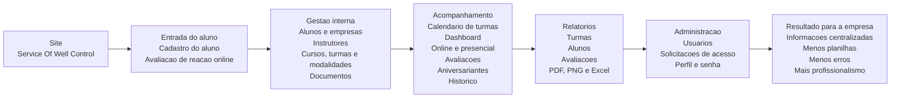

# Fluxograma simples para cliente - Service Of Well Control

Este fluxograma e uma versao resumida para apresentar as funcionalidades do site para um cliente, sem detalhes tecnicos de rotas ou API.

## Fluxograma comercial

## Resumo para apresentar

O site centraliza o processo da Service Of Well Control em um unico ambiente: cadastro dos alunos, organizacao das turmas, controle de modalidade online/presencial, avaliacoes de reacao, documentos, historico, usuarios e relatorios.

Na pratica, o aluno consegue se cadastrar e responder avaliacoes diretamente pelo site, enquanto a equipe acompanha tudo pelo painel administrativo, com calendario, dashboard, filtros e exportacoes em PDF, PNG e Excel.

O resultado e uma operacao mais organizada, com menos dependencia de planilhas, menos risco de perda de informacao e uma apresentacao mais profissional para o cliente final.
