# Fluxograma e rotas do site - Service Of Well Control

Este documento mapeia as principais possibilidades de uso do site, as rotas de tela e os caminhos de navegacao entre as areas publica, aluno e administrador.

## Fluxograma geral

```mermaid
flowchart TD
  A["Entrada no site"] --> B["/cadastro"]
  A --> C["/login"]
  A --> D["/solicitar-acesso"]
  A --> E["/avaliacao"]
  A --> F["/avaliacao/:turmaId"]
  A --> G["/"]

  G --> B

  B --> B1["Consultar CPF"]
  B1 --> B2["Completar cadastro"]
  B2 --> C

  D --> D1["Solicitar acesso administrativo"]
  D1 --> C

  E --> E1["Validar CPF"]
  F --> E1
  E1 --> E2["Responder avaliacao de reacao"]
  E2 --> E3["Enviar avaliacao"]

  C --> C1{"Login aprovado?"}
  C1 -->|Aluno| H["/aluno"]
  C1 -->|Admin| I["/admin"]
  C1 -->|Nao| C

  H --> H1["Ver area do aluno"]
  H --> H2["Sair"]
  H2 --> C

  I --> J["Calendario"]
  I --> K["Dashboard"]
  I --> L["Perfil"]
  I --> M["Cadastros"]
  I --> N["Turmas"]
  I --> O["Avaliacoes"]
  I --> P["Relatorios"]
  I --> Q["Administracao"]

  J --> J1["Visualizar turmas por mes"]
  J --> J2["Ver totais: alunos, presencial e online"]
  J --> J3["Abrir turma"]
  J3 --> N1["/admin/turmas/:id"]

  K --> K1["Ver indicadores"]
  K --> K2["Ver graficos"]
  K --> K3["Abrir turma"]
  K3 --> N1

  L --> L1["Editar perfil"]
  L --> L2["Alterar senha"]

  M --> M1["/admin/empresas"]
  M --> M2["/admin/alunos"]
  M --> M3["/admin/documentos"]
  M --> M4["/admin/instrutores"]
  M --> M5["/admin/cursos-turmas"]
  M --> M6["/admin/modalidades-aula"]

  M1 --> M1A["Criar, editar e excluir empresas"]
  M2 --> M2A["Criar, editar e excluir alunos"]
  M2 --> M2B["Abrir perfil do aluno"]
  M2B --> M2C["/admin/alunos/:id"]
  M3 --> M3A["Consultar documentos"]
  M3 --> M3B["Abrir perfil do aluno"]
  M3B --> M2C
  M4 --> M4A["Criar, editar e excluir instrutores"]
  M5 --> M5A["Gerenciar cursos"]
  M5 --> M5B["Gerenciar classificacoes"]
  M5 --> M5C["Gerenciar locais"]
  M5 --> M5D["Gerenciar salas online"]
  M5 --> M5E["Criar, editar e excluir turmas"]
  M5 --> M5F["Concluir e reabrir turmas"]
  M5 --> M5G["Concluir e reabrir alunos da turma"]
  M5E --> N1
  M6 --> M6A["Criar, editar e excluir modalidades de aula"]

  M2C --> M2D["Editar dados do aluno"]
  M2C --> M2E["Excluir aluno"]
  M2C --> M2F["Enviar documento"]
  M2C --> M2G["Excluir documento"]
  M2C --> M2H["Abrir turma do aluno"]
  M2H --> N1

  N --> N1
  N1 --> N2["Ver dados da turma"]
  N1 --> N3["Ver alunos da turma"]
  N1 --> N4["Ver se respondeu avaliacao"]
  N1 --> N5["Copiar link de avaliacao"]
  N1 --> N6["Concluir ou reabrir turma"]
  N1 --> N7["Concluir ou reabrir aluno"]
  N1 --> N8["Gerar PDF ou PNG da turma"]
  N1 --> M2C

  O --> O1["/admin/controle-avaliacoes"]
  O --> O2["/admin/relatorio-avaliacoes"]
  O --> O3["/admin/avaliacoes/:id"]
  O --> O4["/admin/avaliacoes"]

  O1 --> O1A["Escolher turma"]
  O1 --> O1B["Filtrar respondidos e pendentes"]
  O1 --> O1C["Abrir perfil do aluno"]
  O1 --> O1D["Ver avaliacao"]
  O1C --> M2C
  O1D --> O3

  O2 --> O2A["Filtrar avaliacoes"]
  O2 --> O2B["Ver metricas e graficos"]
  O2 --> O2C["Ordenar taxa por turma"]
  O2 --> O2D["Exportar PDF, PNG e Excel"]
  O2 --> O2E["Clicar no bloco para ver avaliacao"]
  O2 --> O2F["Clicar no nome para abrir perfil"]
  O2E --> O3
  O2F --> M2C

  O3 --> O3A["Ver avaliacao de reacao"]
  O3 --> O3B["Gerar cabecalho SWC com dados do aluno"]
  O3 --> O3C["Baixar PDF ou PNG"]

  O4 --> O2

  P --> P1["/admin/relatorio-avaliacoes"]
  P --> P2["/admin/relatorio-turmas"]
  P --> P3["/admin/relatorio-alunos"]

  P2 --> P2A["Filtrar turmas"]
  P2 --> P2B["Ver total, online e presencial"]
  P2 --> P2C["Exportar PDF, PNG e Excel"]
  P2 --> P2D["Abrir turma"]
  P2D --> N1

  P3 --> P3A["Filtrar alunos"]
  P3 --> P3B["Exportar PDF, PNG e Excel"]
  P3 --> P3C["Abrir perfil do aluno"]
  P3C --> M2C

  Q --> Q1["/admin/aniversariantes"]
  Q --> Q2["/admin/historico"]
  Q --> Q3["/admin/solicitacoes"]
  Q --> Q4["/admin/usuarios"]

  Q1 --> Q1A["Ver aniversariantes por mes"]
  Q1 --> Q1B["Criar, editar e excluir mensagens"]
  Q1 --> Q1C["Abrir perfil do aluno"]
  Q1C --> M2C

  Q2 --> Q2A["Filtrar historico"]
  Q2 --> Q2B["Abrir perfil do aluno"]
  Q2B --> M2C

  Q3 --> Q3A["Ver solicitacoes pendentes"]
  Q3 --> Q3B["Aprovar usuario admin"]
  Q3 --> Q3C["Excluir solicitacao"]

  Q4 --> Q4A["Ver administradores"]
  Q4 --> Q4B["Alterar papel do usuario"]

  I --> R1["Notificacao de aniversarios"]
  I --> R2["Notificacao de solicitacoes pendentes"]
  R1 --> Q1
  R2 --> Q3
```

## Rotas do frontend

| Rota | Acesso | Tela | O que permite fazer |
| --- | --- | --- | --- |
| `/` | Publico | Redirecionamento | Envia automaticamente para `/cadastro`. |
| `/cadastro` | Publico | Cadastro do aluno | Consultar CPF, completar cadastro e criar acesso de aluno. |
| `/login` | Publico | Login | Entrar como admin ou aluno. Admin vai para `/admin`; aluno vai para `/aluno`. |
| `/solicitar-acesso` | Publico | Solicitacao de acesso | Pedir acesso administrativo para aprovacao. |
| `/avaliacao` | Publico | Avaliacao de reacao | Validar CPF, escolher/confirmar turma e responder avaliacao. |
| `/avaliacao/:turmaId` | Publico | Avaliacao vinculada a turma | Responder avaliacao de uma turma especifica. |
| `/aluno` | Aluno autenticado | Area do aluno | Ver area do aluno e sair da conta. |
| `/admin` | Admin | Calendario | Ver turmas no calendario e abrir detalhes da turma. |
| `/admin/calendario` | Admin | Calendario | Mesma tela de calendario acessivel pelo menu. |
| `/admin/dashboard` | Admin | Dashboard | Ver indicadores, graficos e turmas recentes/proximas. |
| `/admin/perfil` | Admin | Perfil | Atualizar dados do usuario e alterar senha. |
| `/admin/empresas` | Admin | Empresas | Criar, editar, listar e excluir empresas. |
| `/admin/alunos` | Admin | Alunos | Criar, editar, listar, excluir e abrir perfil de alunos. |
| `/admin/alunos/:id` | Admin | Perfil do aluno | Ver dados, editar, excluir, enviar/excluir documentos e abrir turmas do aluno. |
| `/admin/documentos` | Admin | Consulta de documentos | Procurar documentos e abrir perfil do aluno relacionado. |
| `/admin/instrutores` | Admin | Instrutores | Criar, editar, listar e excluir instrutores. |
| `/admin/cursos-turmas` | Admin | Cursos e turmas | Gerenciar cursos, classificacoes, locais, salas online, turmas e alunos das turmas. |
| `/admin/modalidades-aula` | Admin | Modalidades de aula | Criar, editar, listar e excluir modalidades de aula. |
| `/admin/turmas/:id` | Admin | Detalhe da turma | Ver dados da turma, alunos, resposta de avaliacao, concluir/reabrir e gerar relatorios. |
| `/admin/avaliacoes` | Admin | Redirecionamento | Redireciona para `/admin/relatorio-avaliacoes`. |
| `/admin/avaliacoes/:id` | Admin | Avaliacao de reacao | Ver avaliacao individual, gerar cabecalho SWC e baixar PDF/PNG. |
| `/admin/controle-avaliacoes` | Admin | Controle de avaliacoes | Ver quem respondeu ou nao por turma, abrir perfil e avaliacao. |
| `/admin/aniversariantes` | Admin | Aniversariantes | Ver aniversariantes, administrar mensagens e abrir perfil do aluno. |
| `/admin/historico` | Admin | Historico | Filtrar movimentacoes e abrir perfil do aluno. |
| `/admin/usuarios` | Admin | Usuarios | Ver administradores e alterar papel do usuario. |
| `/admin/solicitacoes` | Admin | Solicitacoes | Aprovar ou excluir solicitacoes de acesso administrativo. |
| `/admin/relatorio-avaliacoes` | Admin | Relatorio de avaliacoes | Filtrar, ordenar, analisar metricas, abrir perfil/avaliacao e exportar PDF, PNG e Excel. |
| `/admin/relatorio-turmas` | Admin | Relatorio de turmas | Filtrar turmas, ver totais, abrir turma e exportar PDF, PNG e Excel. |
| `/admin/relatorio-alunos` | Admin | Relatorio de alunos | Filtrar alunos, abrir perfil e exportar PDF, PNG e Excel. |

## Mapa funcional por modulo

| Modulo | Principais acoes |
| --- | --- |
| Cadastro publico | Consultar CPF, preencher dados pessoais, vincular login ao aluno e finalizar cadastro. |
| Solicitacao de acesso | Enviar pedido para virar administrador, aguardando aprovacao em solicitacoes. |
| Login | Autenticar usuario, separar fluxo de admin e aluno, sair da conta. |
| Avaliacao publica | Validar CPF/turma, responder perguntas de reacao e enviar avaliacao. |
| Calendario | Navegar por mes, ver cursos por dia, ver total de alunos, online e presencial, abrir turma. |
| Dashboard | Acompanhar indicadores gerais, graficos de alunos/turmas/avaliacoes e abrir turmas. |
| Empresas | Manter cadastro de empresas usadas nos alunos e relatorios. |
| Alunos | Criar, editar, excluir, pesquisar, abrir perfil, controlar dados, documentos e historico de turmas. |
| Documentos | Consultar documentos cadastrados nos alunos e abrir o perfil relacionado. |
| Instrutores | Manter cadastro de instrutores usados nas turmas e relatorios. |
| Cursos e turmas | Manter cursos, classificacoes, locais, salas online, turmas, alunos vinculados e status de conclusao. |
| Modalidades de aula | Manter modalidades de aula usadas nos alunos/turmas. |
| Detalhe da turma | Consultar dados, alunos, status, avaliacao de reacao, link publico e exportacoes. |
| Controle de avaliacoes | Conferir por turma quem respondeu, quem esta pendente, abrir perfil ou avaliacao. |
| Relatorio de avaliacoes | Filtrar avaliacoes, ver taxa por turma, ordenar colunas, exportar e abrir detalhes. |
| Avaliacao de reacao | Visualizar avaliacao individual com cabecalho SWC e baixar PDF/PNG. |
| Relatorio de turmas | Filtrar turmas por periodo/status/curso/modalidade, ver totais e exportar. |
| Relatorio de alunos | Filtrar alunos por empresa/curso/modalidade/status e exportar. |
| Aniversariantes | Ver aniversarios do mes, receber notificacao lateral e gerenciar mensagens. |
| Historico | Auditar movimentacoes e acessar aluno relacionado. |
| Solicitacoes | Receber notificacao lateral, aprovar admin ou remover solicitacao pendente. |
| Usuarios | Administrar usuarios aprovados e seus papeis. |
| Perfil | Atualizar dados do usuario logado e senha. |

## Rotas principais da API

| Prefixo | Principais endpoints | Usado para |
| --- | --- | --- |
| `/api/health` | `GET /api/health` | Verificar se o backend esta online. |
| `/api/auth` | `POST /login`, `POST /register`, `POST /register/lookup`, `PUT /register/complete`, `POST /request-access`, `GET /me`, `PUT /me`, `PUT /me/password` | Login, cadastro, solicitacao de acesso e perfil. |
| `/api/public` | `GET /companies`, `GET /classes`, `GET /classes/:id`, `POST /evaluations/validate`, `POST /evaluations` | Dados publicos e avaliacao de reacao. |
| `/api/users` | `GET /`, `PATCH /:id/role`, `PATCH /:id/approve-admin`, `DELETE /:id` | Usuarios, solicitacoes e aprovacoes. |
| `/api/students` | `GET /`, `GET /:id`, `PUT /:id`, `DELETE /:id`, `POST /:id/documents`, `DELETE /:id/documents/:documentId`, `GET /birthdays`, `GET /birthday-messages`, `POST /birthday-messages`, `PUT /birthday-messages/:id`, `DELETE /birthday-messages/:id`, `GET /report-options`, `GET /report`, `GET /document-browser` | Alunos, documentos, aniversarios e relatorio de alunos. |
| `/api/companies` | `GET /`, `POST /`, `PUT /:id`, `DELETE /:id` | Cadastro de empresas. |
| `/api/instructors` | `GET /`, `POST /`, `PUT /:id`, `DELETE /:id` | Cadastro de instrutores. |
| `/api/locations` | `GET /`, `POST /`, `PUT /:id`, `DELETE /:id` | Cadastro de locais presenciais. |
| `/api/online-rooms` | `GET /`, `POST /`, `PUT /:id`, `DELETE /:id` | Cadastro de salas online. |
| `/api/class-modalities` | `GET /`, `POST /`, `PUT /:id`, `DELETE /:id` | Cadastro de modalidades de aula. |
| `/api/courses` | `GET /`, `POST /`, `PUT /:id`, `DELETE /:id` | Cadastro de cursos. |
| `/api/course-classifications` | `GET /`, `POST /`, `PUT /:id`, `DELETE /:id` | Cadastro de classificacoes de cursos. |
| `/api/classes` | `GET /`, `POST /`, `GET /:id`, `PUT /:id`, `DELETE /:id`, `PATCH /:id/complete`, `PATCH /:id/reopen`, `PATCH /:id/students/:studentId/complete`, `PATCH /:id/students/:studentId/reopen`, `GET /:id/evaluation-status`, `GET /report-options`, `GET /report` | Turmas, alunos da turma, status, calendario e relatorio de turmas. |
| `/api/evaluations` | `GET /metrics`, `GET /report-options`, `GET /report`, `GET /details`, `GET /:id` | Relatorios, metricas e detalhe de avaliacoes. |
| `/api/dashboard` | `GET /` | Indicadores do dashboard. |
| `/api/calendar` | `GET /` | Dados do calendario. |
| `/api/history` | `GET /` | Historico/auditoria. |

## Rotas com navegacao cruzada

| Origem | Acao | Destino |
| --- | --- | --- |
| Calendario | Clicar em uma turma | `/admin/turmas/:id` |
| Dashboard | Clicar em uma turma | `/admin/turmas/:id` |
| Cursos e turmas | Clicar em uma turma | `/admin/turmas/:id` |
| Cursos e turmas | Clicar em um aluno da turma | `/admin/alunos/:id` |
| Detalhe da turma | Clicar em um aluno | `/admin/alunos/:id` |
| Perfil do aluno | Clicar em uma turma do aluno | `/admin/turmas/:id` |
| Consulta de documentos | Abrir perfil | `/admin/alunos/:id` |
| Controle de avaliacoes | Clicar no aluno | `/admin/alunos/:id` |
| Controle de avaliacoes | Abrir avaliacao | `/admin/avaliacoes/:id` |
| Relatorio de avaliacoes | Clicar no bloco da linha | `/admin/avaliacoes/:id` |
| Relatorio de avaliacoes | Clicar no nome do aluno | `/admin/alunos/:id` |
| Relatorio de turmas | Clicar na turma | `/admin/turmas/:id` |
| Relatorio de alunos | Clicar no aluno | `/admin/alunos/:id` |
| Aniversariantes | Abrir aluno | `/admin/alunos/:id` |
| Historico | Abrir aluno | `/admin/alunos/:id` |
| Notificacao de aniversarios | Clicar na notificacao | `/admin/aniversariantes` |
| Notificacao de solicitacoes | Clicar na notificacao | `/admin/solicitacoes` |
| `/admin/avaliacoes` | Acessar rota antiga | `/admin/relatorio-avaliacoes` |

